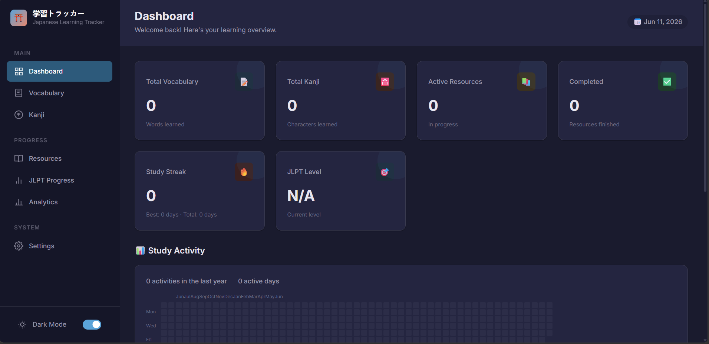
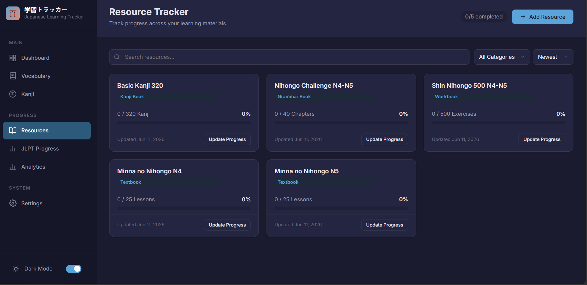
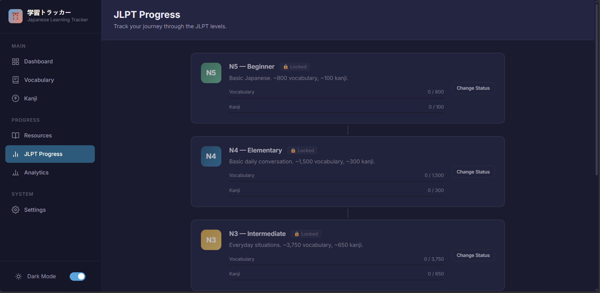
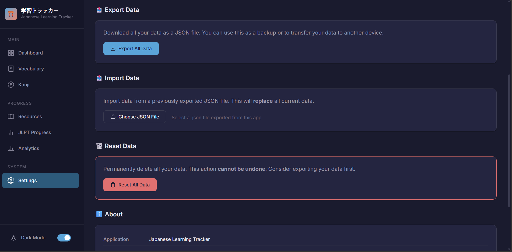

# Japanese Learning Tracker

A portfolio-quality Japanese learning dashboard built with HTML, CSS, and Vanilla JavaScript. Track your vocabulary, kanji, study resources, JLPT progress, and daily streaks — all in a clean, responsive interface with dark mode support.


## Live Demo

https://abhishek-tanniru.github.io/japanese-learning-tracker/

## Features

### Vocabulary Tracker
- Add, edit, and delete vocabulary entries with Japanese word, English meaning, reading, JLPT level, and notes
- Search and filter by JLPT level (N5–N1)
- Sort by date, alphabetical order, or JLPT level
- Duplicate detection to prevent re-adding existing words

### Kanji Tracker
- Track individual kanji characters with meanings, readings, and JLPT levels
- Search and filter functionality matching the vocabulary tracker
- Visual kanji character display with consistent styling

### Resource Progress Tracker
- Monitor textbooks, workbooks, grammar books, and custom learning resources
- Track completion progress with unit-based tracking (Lessons, Chapters, Pages, etc.)
- Progress bars showing percentage completion
- Pre-loaded with popular resources (Minna no Nihongo, Shin Nihongo 500, Basic Kanji 320)

### JLPT Progress Roadmap
- Visual roadmap from N5 (Beginner) to N1 (Advanced)
- Status tracking: Locked → In Progress → Completed
- Vocabulary and kanji targets for each level
- Progress bars showing how close you are to each level's requirements

### Study Streaks & Activity Tracking
- Automatic daily streak calculation
- Longest streak and total study days tracking
- Activity log with timestamped entries for all actions (add, edit, delete, import, export)

### GitHub-Style Activity Heatmap
- Visual calendar showing study activity intensity
- Color-coded cells from light to dark based on daily activity count
- Month and day-of-week labels for easy navigation

### Analytics Dashboard
- Vocabulary growth chart (line chart over time)
- Kanji growth chart (line chart over time)
- Resource completion chart (bar chart)
- Weekly activity breakdown (bar chart)
- JLPT level distribution with progress bars toward targets
- Configurable time range: Last 30 days, 90 days, 1 year, or all time

### Data Management
- **Export** all data as a JSON backup file
- **Import** data from a previously exported file with validation and preview
- **Reset** all data with double-confirmation safety (type "RESET" to confirm)
- Storage usage monitoring

### UI/UX
- **Dark Mode** — toggle between light and dark themes with persistent preference
- **Responsive Design** — works on desktop, tablet, and mobile with a slide-out sidebar
- **Keyboard accessible** — focus-visible styles, modal escape-to-close
- **Smooth animations** — fade-in, slide-up, and stagger effects
- **Custom scrollbars** — styled for WebKit and Firefox

## Screenshots

### Dashboard


### Vocabulary Tracker


### Analytics


### Dark Mode


## Tech Stack

| Layer | Technology |
|-------|-----------|
| Markup | HTML5 |
| Styling | CSS3 (Custom Properties, Grid, Flexbox, Animations) |
| Logic | Vanilla JavaScript (ES6+), No frameworks or build tools |
| Storage | LocalStorage with a `StorageService` abstraction layer |
| Fonts | Inter (UI) + Noto Sans JP (Japanese text) via Google Fonts |

### Architecture

```
UI (HTML Templates)
  └→ Page Modules (render + init pattern)
      └→ StorageService (CRUD abstraction)
          └→ LocalStorage (browser persistence)
```

- **Render/Init Pattern** — Each page module exports a `render(storage)` function that returns HTML, and an `init(storage)` function that attaches event listeners after the DOM is painted
- **StorageService** — A class that wraps all LocalStorage operations with a `jlt_` key prefix, providing `getAll`, `create`, `update`, `delete`, `search`, and `filter` methods
- **No Build Step** — All JS files are loaded via `<script>` tags in order; no bundler, transpiler, or package manager required

## Project Structure

```
Japanese Learning Tracker/
├── index.html                  # Single-page app entry point
├── .gitignore
├── screenshots/                # App screenshots for README
├── css/
│   ├── variables.css           # Design tokens (colors, spacing, typography)
│   ├── base.css                # CSS reset, utilities, animations
│   ├── layout.css              # Sidebar, main content, grid systems
│   ├── components.css          # Buttons, cards, modals, toasts, badges
│   ├── tracker.css             # Vocabulary & Kanji tracker styles
│   ├── resources.css           # Resource tracker styles
│   ├── dashboard.css           # Dashboard-specific styles
│   ├── jlpt.css                # JLPT roadmap styles
│   ├── analytics.css           # Charts, heatmap, distribution bars
│   └── responsive.css          # Tablet, mobile, and print media queries
└── js/
    ├── app.js                  # Router, dark mode, initialization
    ├── data/
    │   └── defaults.js         # Seed data (resources, JLPT levels, activity types)
    ├── services/
    │   └── StorageService.js   # LocalStorage CRUD abstraction
    ├── utils/
    │   ├── helpers.js          # Formatting, debounce, toast, modal, XSS escaping
    │   ├── validators.js       # Input validation for vocab, kanji, resources, imports
    │   ├── charts.js           # Canvas-based line and bar chart rendering
    │   └── heatmap.js          # GitHub-style activity heatmap renderer
    └── modules/
        ├── Dashboard.js        # Dashboard page (stats, heatmap, activity feed)
        ├── VocabTracker.js     # Vocabulary CRUD, search, pagination
        ├── KanjiTracker.js     # Kanji CRUD, search, pagination
        ├── ResourceTracker.js  # Resource CRUD with progress tracking
        ├── JLPTProgress.js     # JLPT roadmap UI and status management
        ├── Analytics.js        # Charts, growth data, JLPT distribution
        └── Settings.js         # Data export, import, reset, app info
```

## Installation

1. **Clone the repository**
   ```bash
   git clone https://github.com/abhishek-tanniru/Japanese-Learning-Tracker.git
   ```

2. **Open `index.html` in your browser**
   ```bash
   # No server required — just open the file directly
   open index.html
   # or on Windows:
   start index.html
   ```

That's it. No dependencies, no build step, no `npm install`.

## How It Works

- All data is stored in your browser's **LocalStorage** (under the `jlt_` prefix)
- On first visit, the app seeds default learning resources and JLPT level definitions
- Navigate between pages using the sidebar — the URL hash updates (e.g., `#vocabulary`, `#kanji`)
- Export your data regularly as a backup — LocalStorage is browser-specific and doesn't sync across devices

## Why I Built This

I am currently learning Japanese and wanted a way to track:

- Vocabulary growth
- Kanji progress
- Resource completion
- JLPT progression
- Daily study consistency

Instead of using multiple spreadsheets and notes, I built a centralized dashboard using vanilla JavaScript.

## Technical Challenges

Some challenges solved during development:

- Designing a StorageService abstraction layer for future database migration
- Building a GitHub-style contribution heatmap without external libraries
- Implementing canvas-based analytics charts using pure JavaScript
- Creating a responsive dashboard without frameworks
- Managing application state using LocalStorage

## Key Learnings

Through this project I learned:

- Modular JavaScript architecture
- DOM manipulation
- LocalStorage data persistence
- Responsive UI design
- Canvas-based chart rendering
- Input validation and data management

## Browser Compatibility

Works on all modern browsers — Chrome, Firefox, Edge, and Safari. No polyfills or transpilation required.

## Future Improvements

- [ ] Backend API with Node.js/Express
- [ ] User authentication and multi-user support
- [ ] Cloud sync across devices
- [ ] Database integration (PostgreSQL / MongoDB)
- [ ] Audio pronunciation for vocabulary entries
- [ ] Furigana toggle for kanji readings
- [ ] PWA support with offline access
- [ ] Kanji radical breakdown view

## Author

**Abhishek Kumar Tanniru** — [GitHub Profile](https://github.com/abhishek-tanniru)

---

Built as a portfolio project to demonstrate proficiency in vanilla HTML, CSS, and JavaScript with a focus on clean architecture, responsive design, and data persistence.
